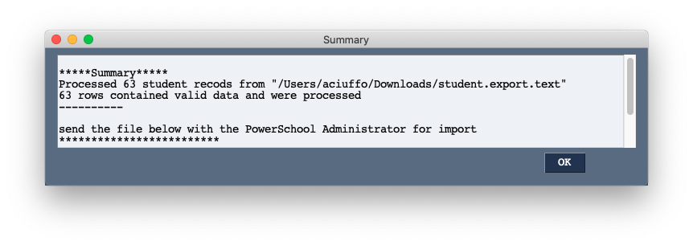
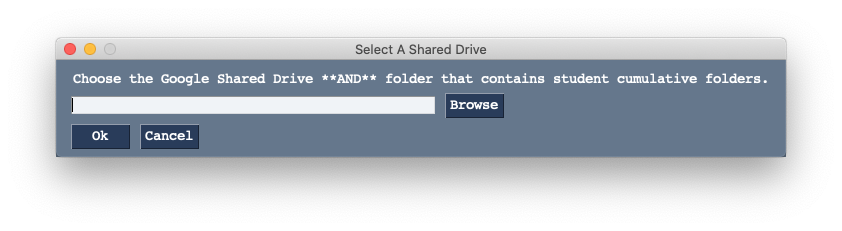
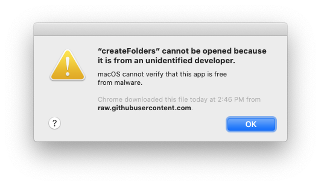
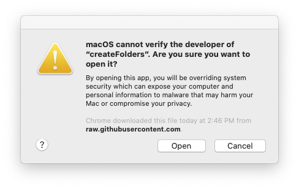
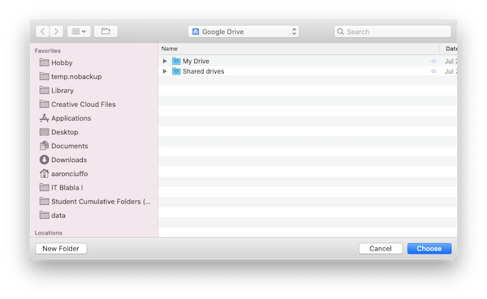

# createFolders
## Current Version: 1.01.0
Create student cumulative folders on Google Drive using Google FileStream using exports from PowerSchool.


## Quick Start
**IMPORTANT if you have never run the application see the [First Run Instructions](#FirstRun) below!**

This assumes you already have [Google FileStream](https://dl.google.com/drive-file-stream/GoogleDriveFileStream.dmg) installed and are signed in as well as a prepared student.export file from PowerSchool.

1. Locate the createFolders icon in your `Applications` folder and double click on it to run
    * If you receive error messages or popups preventing you from running the application see the [Help](#Help) section
2. Once the applicaiton has opened (this can take 10-30 seconds sometimes), click "Process File" to begin processing a student.export file from PowerSchool
3. If this is the first time you have run this program, you will be asked to choose a Google Shared drive **and** cumulative student folder. 
    * If you are unsure how to do this, see the [Help](#Help) section
4. When prompted slect a student export file to process by clicking "Browse"
5. Click "Ok" to begin the processing
6. When the process is complete, review the summary
    * A record of the completed tasks is made on your desktop in a folder called `createFolders`
    * Make sure to send the `YYYY-MM-DD_Portfolio_Links_for_PowerSchool.csv` to the PowerSchool Administrator
7. Make sure you review any error files that were produced. These files include student folders that could not be created as well as potential solutions for resolving the issue.
8. You may process another file immediately if needed

## Instructions
createFolders depends on a working instance of [Google FileStream](https://dl.google.com/drive-file-stream/GoogleDriveFileStream.dmg) installed and signed in with an account that can write to the Student Cumulative Folders shared drive. See the [Help](#Help) section for assistance in setting up FileStream.

### Install create_folders
<a name="Install"></a>
1. Download the application from [this link](https://github.com/txoof/portfolioCreator/raw/master/createfolders.pkg)
2. Locate the create_folders icon in your Applications folder
3. Launch the application
4. If this is the first time you have run create_folders on this computer you will be prompted to select the Google Shared Drive **AND** the folder that contains Student Cumulative Folders. 
   * see [below](#ChooseSharedDrive) for more detailed instructions 
2. Locate the file `createFolders.pkg` -- likely in your `Downloads` folder
3. Double click on the file to run the installer
    * You may need an administrator's password to install this


<a name="prepareExport"> </a>
### Prepare a student.export.text file

createFolders reads data from PowerSchool exports to create folders in Google Drive and prepare links for the demographics page. This section details the preparation of a student.export.text file that can be used with createFolders.

createFolders will **not create duplicate folders** for existing students and will not create folders when a duplicate student number is found. This means that you can run the same batch of students several times without harm. If a folder already exists, it will simply be checked for consistency and further ignored.

#### Locate Students for Export
* Locate all students that do not have portfolio links use: `area=`
* Locate students by grade level: `Grade_Level=X`
* Locate students by entry date: `DistrictEntryDate>=MM/DD/YYYY`

#### Quick Export Fields
When running a Quick Export the following fileds **must be included**. Any additional fields will be ignored. 
```
LastFirst
Student_Number
ClassOf
```

### Program Opperation
createFolders has only four options when run in graphical mode:
* Process File
* Change Shared Drive
* Help
* Exit

<a name="ProcessFile"></a>
#### Process File

Select a student.export file and create student folders as needed. The student.export file must be in a delimited format such as a tsv or csv with the folowing column headers: `LastFirst, Student_Number, ClassOf`. These fields can be in any order. Additional fields will be ignored.

Data rows must follow the following data types:
* `LastFirst` -- string 
* `Student_Number` -- integer
* `ClassOf` -- integer

Data rows that do not conform will be ignored and recorded in `~/Desktop/createFolders` as a csv file.

Once the opporation is completed, a summary of the completed procedures will open. **READ** all of the summary. There may be some students that could not be processed. 

Share the Links TXT file with the PS Administrator so PowerSchool links can be updated.

A report of any Errors and files that must be sent to the PS Administator is stored in a folder on your Desktop called *createFolders*. **READ** the entire window. Be sure to review the any ERROR files and correct the errors! **YOU MUST** run the application again to create forlders for the students with errors. It is possible to simply process the Error file by selecting it. You may also run the same student export again; duplicate folders will ***not*** be created.


#### Change Shared Drive
Choose the shared drive **and folder** where cumulative folders are stored. This is the location where all cumulative folders are stored. createFolders preforms several checks to ensure you have chosen the appropriate drive. For more help see the help section: [Choosing the Shared Drive and Cumulative Student Folder](#ChooseSharedDrive)


createFolders looks for a specific file called `sentryFile_DO_NOT_REMOVE.txt` in the `Student Cumulative Folders (AKA Student Portfolios)` folder. If this file is missing, createFolders will not proceed. See below for more information in remedying this problem.

Choosing an improper Google Shared drive will result in the following errors:
* Local or Non-Google Drive: `"/Users/spamham/Documents" is not a Google Drive. Choose a Google Shared Drive.`
* Google Drive, but typo in folder name: `"/Volumes/GoogleDrive/Shared drives/ASH Student Cumulative Folders/Student Cumulative Folders (AKA Student Portfolios)TYPO!" does not appear to exist on Google Drive. Choose a different Drive and folder.`
* Google Shared Drive that does not contain **`sentryFile_DO_NOT_REMOVE.txt`**: `This does not appear to be the correct folder for Cumulative Student Folders...`

In the event that the **`sentryFile_DO_NOT_REMOVE.txt`** is not found, double check the following:
1. The appropriate google shared drive is chosen
2. The proper **folder** within the drive is chosen and contains **`sentryFile_DO_NOT_REMOVE.txt`**

If the sentry file is has been deleted or is otherwise missing, a new file can be created by running the following command from the terminal. This command must be run from an account that has FileStream running and with access to the shared drive. **It is critical that you double, tripple and quadruple check that this is actually the correct drive and folder before proceeding.**

`$ touch /Volumes/GoogleDrive/Shared drives/DRIVE NAME/FOLDER NAME/sentryFile_DO_NOT_REMOVE.txt`

#### Program Help
The help button provides a brief version of this document.

#### Exit
Exit the program.

#### Command Line Mode
ore debugging features are available on the command line. createFolders will accept student.export files with the `-s [file]` option.

```
$ ./createFolders -h
usage: createFolders [-h] [-s /path/to/student.export.csv]
                     [-g /Volumes/GoogleDrive/Shared drives/ASH Cum Folders/folder/]
                     [-l ERROR, WARNING, INFO, DEBUG] [-v] [--more_help]

optional arguments:
  -h, --help            show this help message and exit
  -s /path/to/student.export.csv, --student_export /path/to/student.export.csv
                        Export from PowerSchool containing: LastFirst,
                        ClassOf, Student_Number
  -g /Volumes/GoogleDrive/Shared drives/ASH Cum Folders/folder/, --google_drive /Volumes/GoogleDrive/Shared drives/ASH Cum Folders/folder/
                        Full path to Google Drive Shared Drive containing
                        cumulative files
  -l ERROR, WARNING, INFO, DEBUG, --log_level ERROR, WARNING, INFO, DEBUG
                        Logging level -- Default: WARNING
  -v, --version         Print version number and exit
  --more_help           Print extened help and exit
```

## Help
### "createFolders" Cannot Be Opened


This error indicates that the program was not created by an "official" developer. In this case, this is not a problem. Take the following steps to run the program:
1. Locate the program file (likely in your `Applications` folder)
2. Right-click or ctrl-click on the file and choose "Open"
3. A pop-up window will likely appear -- *if no pop-up appears, no further action is needed*
    
4. Read the text and choose "Open" -- *this will permenently allow you to open this application by double clicking on the icon*
    * If you download a new version of the application, you *may* need to repeat these steps
    
<a name="ChooseSharedDrive"></a>
### Choosing the Shared Drive and Cumulative Student Folder


createFolders needs to know both which Google Shared Drive to use and the folder where Student Cumulative Folders are stored. The first time you run createFolders, it will ask you to choose the appropriate drive and folder.

1. Click "Browse" to open a folder chooser window
    
    * If FileStream is active and working properly, you will be automatically directed to the Google Drives available to you.
3. Double click the "Shared drives" folder and locate the appropriate folder
    * This is likely called `ASH Student Cumulative Folders` or something similar
4. Locate the folder within the shared drive that contains cumulative folders and click on it
    * This is likely called `Student Cumulative Folders (AKA Student Portfolios)`
5. Click "Choose" to select the folder to return back to createFolders
6. Click "OK" to accept the shared drive
    * createFolders works very hard to ensure you have selected the appropriate drive and will try to prevent you from using an improper folder.
    * You can always change this folder later if you have made a mistake
7. Click "Process File" to begin processing a student.export file

<a name="filestream"></a>
### Setup Google FileStream
Google FileStream is required for createFolders. The user must be signed in with an account that has write permissions to the Student Cumulative folders drive. As of September 2020, users must have the *Manager* attribute on a Google Shared Drive to create folders in Google Filestream.

1. Download [Google FileStream](https://dl.google.com/drive-file-stream/GoogleDriveFileStream.dmg) and run the installer.
2. Launch Google FileStream if it is not running (look for the icon in the menu bar) and click "Sign in"
    
3. Use your @ash.nl credentials for an account that has access to the cumulative folders drive.
    * You will likely be asked to sign in using your two-step verification; this is normal
4. Click on the filestream icon in the menu bar and click on the folder icon to view your google drive files
    * It may take several minutes before your folders and files are all visible
5. Browse to the `Shared drives` and locate the `ASH Student Cumulative Folders` drive to confirm you have access
    * If you do not have access, you have likely used an account that does not have permissions. Sign out and try again.
    
### Complete Uninstall
To completely uninstall the application do the following:
1. Remove the executable `createFolders` application
2. From the terminal run `$ rm -rf ~/.config/com.txoof.createFolders`

<a name="FirstRun"></a>
## FirstRun

The first time you run the Portfolio Creator application you will need to take some special steps:

1. Make sure [Google FileStream](#filestream) installed and you are signed in!
2. Download the application from [this link](https://github.com/txoof/portfolioCreator/raw/master/createFolders.pkg)
3. Locate the file `createFolders.pkg` -- likely in your `Downloads` folder
4. Double click on the file to run the installer
    * You may need an administrator's password to install this
5. Locate the create_folders icon in your Applications folder
6. Launch the application by double clicking
7. If this is the first time you have run create_folders on this computer you will be prompted to select the Google Shared Drive **AND** the folder that contains Student Cumulative Folders. 
   * see [below](#ChooseSharedDrive) for more detailed instructions 
8. Click *"Process File"* to get started
9. Create an export from powerschool 
   * See: [Create a Student Export](#prepareExport)
10. Click *"Process File"* to process a student export
11. Review the processed files and correct any errors


```python
# !alias mdc /Users/aaronciuffo/bin/develtools/mdconvert README.ipynb
!jupyter-nbconvert --to markdown README.ipynb

```

    [NbConvertApp] Converting notebook README.ipynb to markdown
    [NbConvertApp] Writing 13112 bytes to README.md

